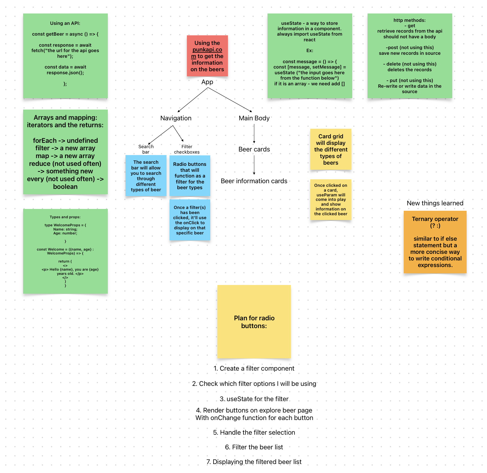

Welcome to my React API project.

Overview:

The task is to build a website using React based on the specifications outline below. This will be based on the Punk API which contains all
the data you will need for the task (there is also a link to a data file which we recommend you use before diving straight into using the
API). Please refer to Earworm as well as the sandbox apps we built together during the module!

You will have to use all of the skills you have gained over the course of the module to complete this challenge. Take things slowly and
follow Reacts recommendation for building an application as outlined at the Thinking in React documentation.

The API used:

Punk-API -> https://punkapi.com/

Setup:

I fist started the project by working on the plan and layout the ground works. This is to make sure I'm not making the mistakes I've made previously where I've stumbled upon the processes of the project.

- First thing was the component tree.
  This needed to be a representation of what I will then eventually be building.

- I also decided to add a few extra post-it notes to make sure that I know and remember what different functions and different syntax are like. This allowed me to spend less time trying to figure out the syntax and more time figuring out the logic of it the project.

Sample code:

- In the code snippet below I was struggling to use the useParams correctly due to minor error. The beerId that's collection the id of the beer clicked on was being used a string rather than a number. After fixing the small issue, the code worked perfectly fine without any issues.

const { beerId } = useParams();
   const moreInfo = beer.find((beer) => beer.id === Number(beerId));

if (moreInfo === undefined) {
   return 
Beer not found
;
}

- Here I have the main logic for my radio buttons and the filtering or the radio button. In the first snippet you'll see that the filter is being used for searchBeer - that was the initial purpose of it. This piece of code was to be used for the search bar and for me to create another function for the radio buttons.

The original search bar function was:

const filteredBeers = beers.filter((beer) =>
   beer.name.toLowerCase().includes(searchBeer)
);

Modified with the addition of the radio buttons:

const filteredBeers = beers
    .filter((beer) => beer.name.toLowerCase().includes(searchBeer))
    .filter((beer) => {
      if (selectedFilter === "High ABV") {
        return beer.abv >= 6.0;
      }
      if (selectedFilter === "Acidity Less Than 4ph") {
        return beer.ph < 4;
      }
      if (selectedFilter === "IBU 41+") {
        return beer.ibu >= 41;
      }
      if (selectedFilter === "IMB 40-") {
        return beer.ibu <= 40;
      }
      return true;
    });

Testing:

The testing is done while creating the webpage. There was no internal testing done for this project. However, this is something that I will be looking to do in the future to see how well the project held up.

Improvements:

- I want to be able to add more features to the project. For example, random facts to show up on the home page every time the page is loaded.
- The filter to take multiple input rather than one at a time.
- To get access to all 300+ beers.

